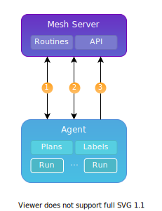
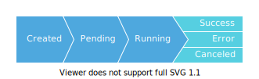

# Poly

Poly is a project focused on implementing and managing agents that can run plans in various environments

The project consists of a mesh API which is the single source of truth, and agents that can be extended and implemented according to the developer's needs.

 

## Workflow

1. The agent registers itself with the API and retrieves an access token
2. The agent sends periodic liveness pings to the API
3. The agent is polling for new runs to perform 

      

## Run Lifecycle

