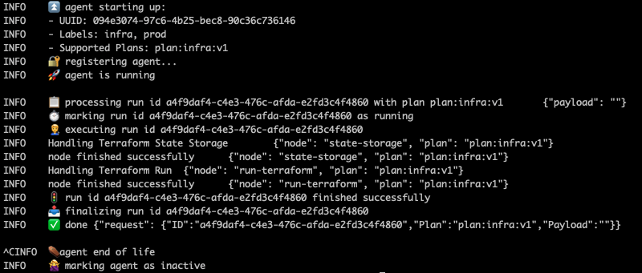
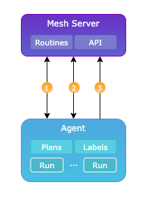

 

# Poly

Poly is a project focused on implementing and managing agents that can run plans in various environments

The project consists of a mesh server which is the single source of truth, and agents that can be extended and implemented according to the developer's needs.

 

## Example run

 

## Workflow

1. The agent registers itself with the API and retrieves an access token
2. The agent is polling the API periodically, and the API returns a list of runs it needs to execute
3. When an agent receives a shutdown signal, it makes an API call to deregister itself

      

## Mesh server

The mesh server provides an API for the agents to interact with and retrieve runs they need to execute

The server also comes with built in `routines`. As an example, a routine that assigns a run to an agent

 

## Agents

Every agent has labels to identify it, and a list of plans it implements
- A plan can be a piece of code for executing a terraform plan
- Agents that implement the same plans can run with different labels, i.e. `prod` or `dev` 

When there's a run request, it specifies which plan should run and the required agent labels to decide which agents can execute the run
### Lifecycle

1. `Created` is the initial status
2. The status changes to `Pending` when an agent is assigned 
3. The status changes to `Running` when an agent starts to execute a run
4. `Success` / `Error` are the usual outcomes of a run
5. `Canceled` status is given if the run didn't complete due to a shutdown signal
